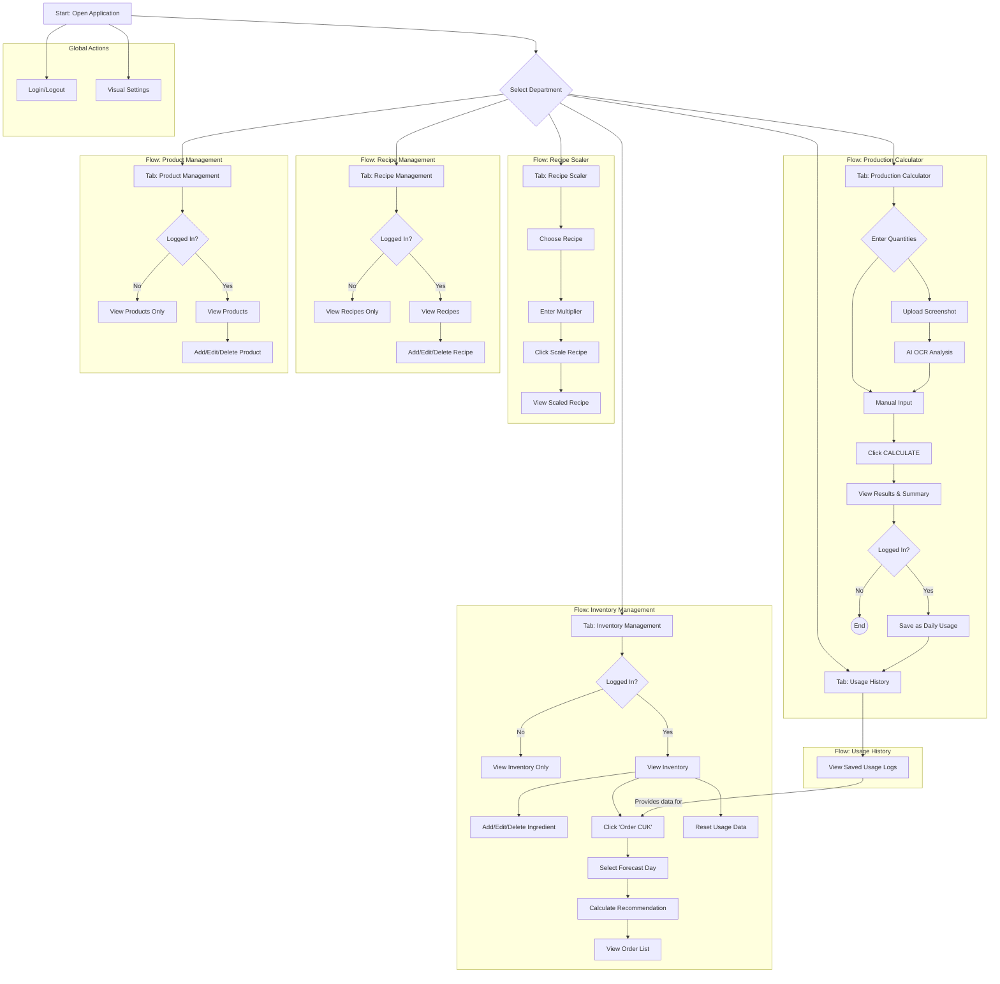

# Application Flowchart

This document contains a flowchart that illustrates the user flow and architecture of the Coffee Town Bakery application.

```mermaid
graph TD
    A[Start: Open Application] --> B{Select Department};

    B --> C1[Tab: Production Calculator];
    B --> C2[Tab: Recipe Scaler];
    B --> C3[Tab: Recipe Management];
    B --> C4[Tab: Product Management];
    B --> C5[Tab: Inventory Management];
    B --> C6[Tab: Usage History];

    subgraph "Global Actions"
        L[Login/Logout]
        S[Visual Settings]
    end

    A --> L;
    A --> S;

    subgraph "Flow: Production Calculator"
        C1 --> D1{Enter Quantities};
        D1 --> D1a[Manual Input];
        D1 --> D1b[Upload Screenshot];
        D1b --> D1c[AI OCR Analysis];
        D1c --> D1a;
        D1a --> D2[Click CALCULATE];
        D2 --> D3[View Results & Summary];
        D3 --> D4{Logged In?};
        D4 -- Yes --> D5[Save as Daily Usage];
        D4 -- No --> D6((End));
        D5 --> C6;
    end

    subgraph "Flow: Recipe Scaler"
        C2 --> E1[Choose Recipe];
        E1 --> E2[Enter Multiplier];
        E2 --> E3[Click Scale Recipe];
        E3 --> E4[View Scaled Recipe];
    end

    subgraph "Flow: Recipe Management"
        C3 --> F1{Logged In?};
        F1 -- No --> F2[View Recipes Only];
        F1 -- Yes --> F3[View Recipes];
        F3 --> F4[Add/Edit/Delete Recipe];
    end

    subgraph "Flow: Product Management"
        C4 --> G1{Logged In?};
        G1 -- No --> G2[View Products Only];
        G1 -- Yes --> G3[View Products];
        G3 --> G4[Add/Edit/Delete Product];
    end

    subgraph "Flow: Inventory Management"
        C5 --> H1{Logged In?};
        H1 -- No --> H2[View Inventory Only];
        H1 -- Yes --> H3[View Inventory];
        H3 --> H4[Add/Edit/Delete Ingredient];
        H3 --> H5[Click 'Order CUK'];
        H5 --> H6[Select Forecast Day];
        H6 --> H7[Calculate Recommendation];
        H7 --> H8[View Order List];
        H3 --> H9[Reset Usage Data];
    end

    subgraph "Flow: Usage History"
        C6 --> I1[View Saved Usage Logs];
        I1 -- Provides data for --> H5;
    end
```
